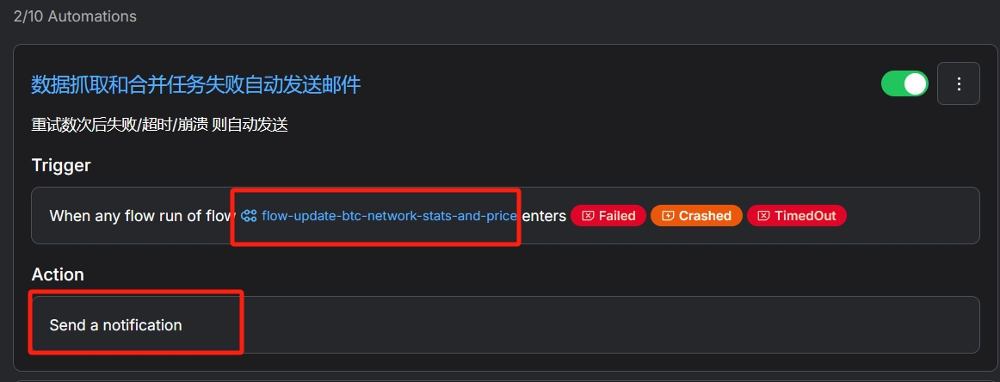
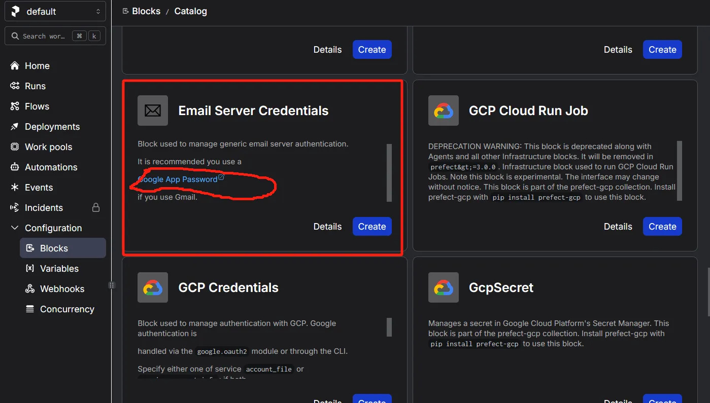

# ETL-Homework


This ETL workflow is based on SaaS and open-source software named "prefect".
It provides simple yet powerful API and DAG based workflow manager: scheduler and task executor.
We could take much advantage from following features:
+ Both Self-Hosted or SaaS is available
+ Simple alert support based on Email
+ DAG based workflow support, with scheduler and executor
+ Work-Pools support, make it easy to do up scaling
+ Simple error handling

We could easily start our data ETL flow, and scale to complex workflow.
Classic tools like `Kafka`, `Hive`, `Elasticsearch` and `Spark` is also available in prefect workflow.

# Core Design Principles
For new products, the ultimate goal is to quickly and lightly launch the business itself.
My design is always follow the rules below:
+ `Design More, Write Less`: It helps us save time and money. 
+ `Write code that is easy to delete, not easy to extend`: Embrace change, adapt to change, and iterate quickly.
+ `Write Tests, Gain Courage`: Only better tests can make you iterate quickly. 

# Development

**Note**: be sure you have python>=3.9 installed

Install requires:
```shell
# poetry is required for development and python>=3.9 is required
pip install poetry
# install env
poetry install

# copy git hook
cp ./scripts/pre-commit.example ./git/hooks/pre-commit

# configure local settings
cp .env.example .env
# then edit it with your favorite editor ( for me it is nano )
# then change the alert email address
# nano .env 
```

Test:
```shell
make test
```

Run on cloud:
```shell
# switch to cloud and login with API-KEY or browser
# note: you should first register an account at https://www.prefect.io/
# visit "signup/login" on landing page of prefect.io
# then follow the link created by following command to finish the setup
make switch2cloud

# create local databases
make sync-db 

# then run task-entry
make local-task
```

Run on local: 
Currently not fully supported, `Task Failure Alert` feature will not work.  

# Deploy
Now we only use local process to serve `depolyment` instance since we have limited calculation and data fetching.

just run:

```shell
make local-task
```

It will make the deployment done.

# End-User Manual
## Error Report

Please setup an automation on platform, just like this:



## Get full CSV report in Email
At first, create credentials to an EmailServerCredentials block
```shell
make register-email-block
# will output a link to register a block
```
Follow the link generated by command above, then search "Email Server Credentials" to create a gmail provider (using Google App Password is recommended).
**Note**: the block name now is hard coded as `etl-gmail-sender`  



If you want to generate a full-report which will be sending to your Email immediately, you may just run:

```shell
# be sure that your network has access to google services
make send-full-report
```

You should have local-task executed more than 5 minutes (except that we will have no data in DB).


## Analysis

Run following command, export a local CSV file which could be imported by almost all OLAP.
```
make export-to-local
```
You could import the full csv to tools like `DuckDB` or any other OLAP (Excel is very ok, HaHa!).

The `generated_data.sqlite` is also a good data source, with clean data.
